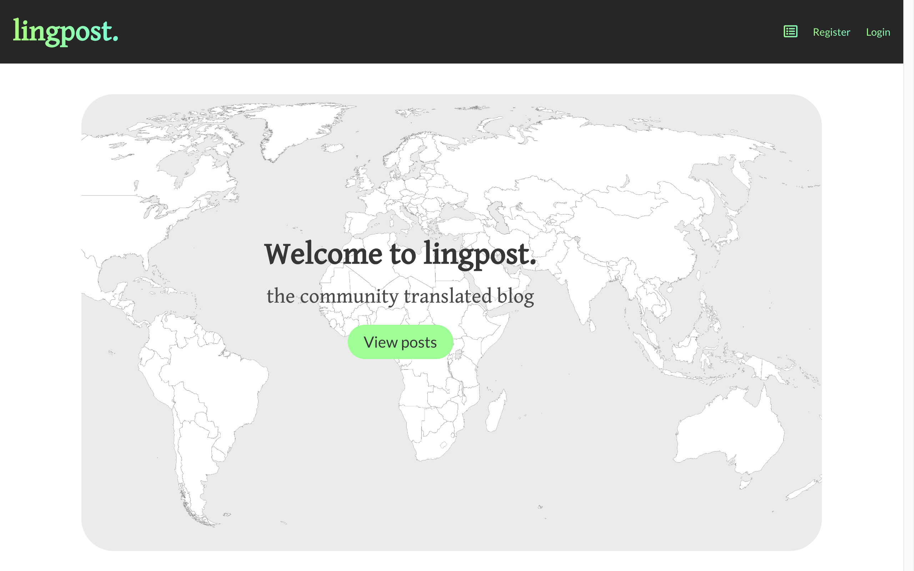

# Project 3

### Aim:
to build a MERN stack app

### Technologies used:
* HTML5
* SCSS
* Javascript
* MongoDB
* Node.js
* Express.js
* React
* Git
* Github
* Webpack
* Heroku
* Bulma

### The site:
The site is a blogging platform with a multilingual twist. Users can post in a variety of languages, and other users are then able to translate the post. In this way users can access content they may otherwise have been unable to, and can benefit from different cultural perspectives. In terms of technical requirements, the site uses an Express API from a Mongo database and uses React on the front end. The articles model has CRUD functionality.

### The process:
The first step was to consider the possible users of the app. The most likely market would be bilingual, as although it is a blogging platform, the USP is the possibility of translating blog posts.  

There are a number of features which could be included in this type of app, but for the MVP I decided to focus on a basic product which would allow users to add, edit and delete posts and translations of those posts. The first step was to consider the personas and how they might interact with the site. As a result of this, I realised the site navigation needed to use as few words as possible, on the basis that some users wouldn't be English speakers. However, this did cause some problems as I was able to design things that I'm not yet able to recreate with code.

Firstly, I outlined the structure of my files and the details I would require in my model. I then created wireframes by hand and with Balsamiq. Once I had enough planning for the MVP, I started by building the back end and testing in insomnia, before writing tests using Mocha and Chai.

I had separated out my MVP into components, so I then started to build these. I added basic styling as I was going, using Bulma as a framework. Having reached MVP, I realised I could reuse certain elements and so I created some additional components.

Finally, I continued styling and made sure the site was still mobile responsive.

### Issues faced:
* One of the biggest problems was getting the right objects and arrays. Adding the whole translation schema into the article schema meant that the article and each separate translation had an id, which caused issues with routes and URLs.
* Managing the seeded data was difficult, as I had not worked with such a large volume before. Managing different languages was an interesting formatting challenge, as there were a lot of accents and quotes.

### Future plans:
* Add a text editing function including bold, italic etc.
* I would like to add a user profile section, where user can update their details as well as save their favourite posts and keep track of their translations.
* I'd also like to add a request function which would allow users to suggest edits on a translation, but which need to be accepted by the original translator.
* A translation API would be an interesting addition. Users could hover over a word they don't understand to see a tooltip with a translation.
